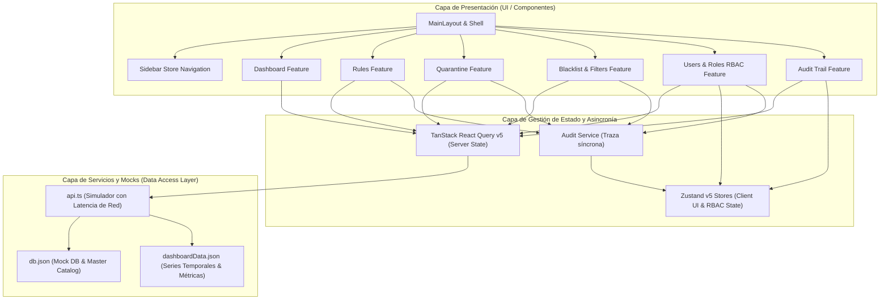
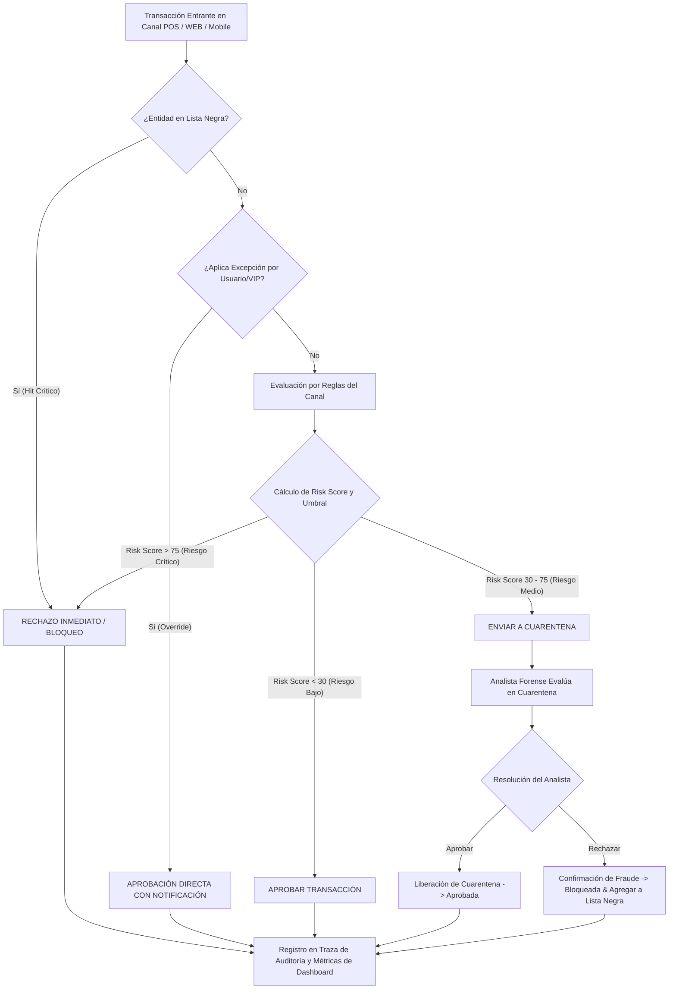
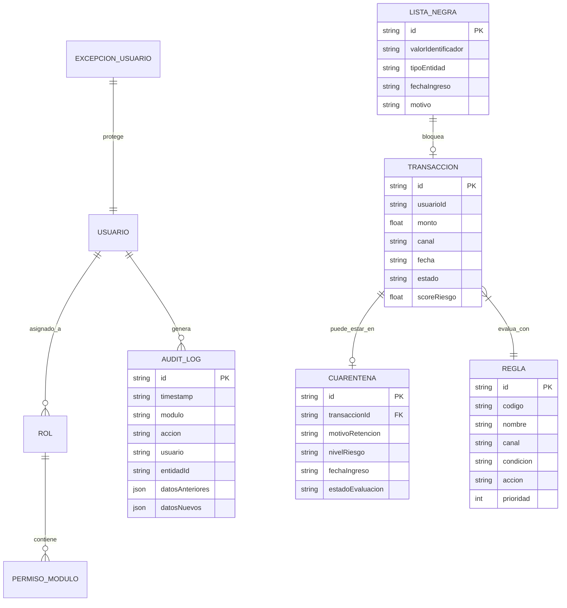
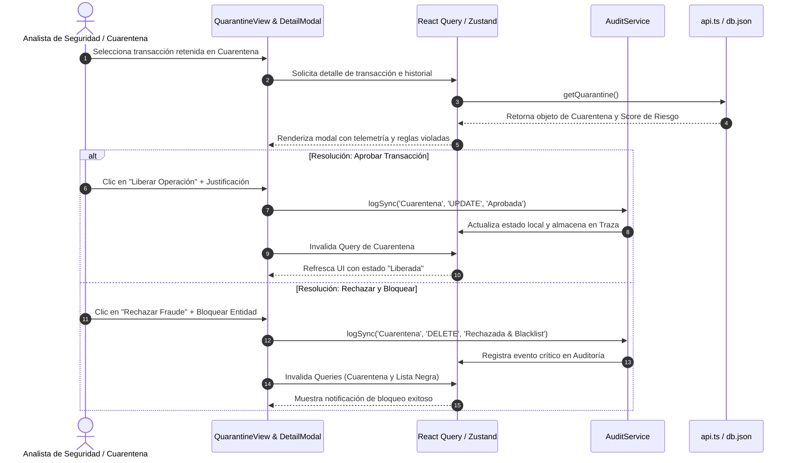
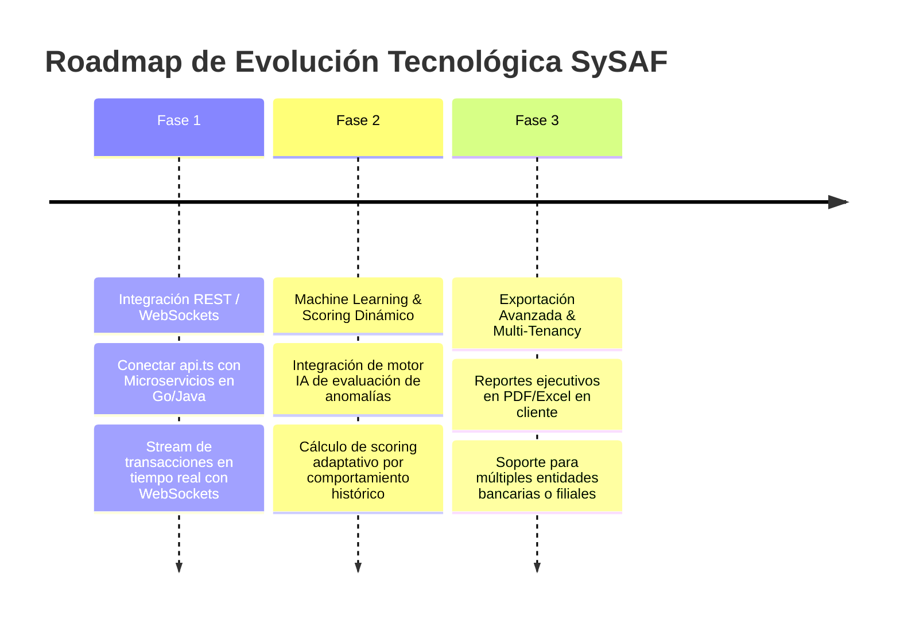

# DOCUMENTACIÓN TÉCNICA Y ESPECIFICACIÓN DE ARQUITECTURA
## Sistema de Supervisión y Prevención Antifraude (SySAF - SYPAGO)

---

> **Versión del Documento:** 1.0.0  
> **Estado:** Documentación Técnica Definitiva  
> **Perfil de Redacción:** Senior Software Engineer / Lead Solutions Architect  
> **Fecha de Actualización:** Agosto 2026  

---

## 📋 1. RESUMEN EJECUTIVO Y VISIÓN GENERAL

**SySAF** (Sistema de Supervisión y Prevención Antifraude) es una plataforma web enterprise desarrollada por **SYCOM**, orientada a la detección, monitoreo, análisis forense y neutralización de transacciones sospechosas o fraudulentas en tiempo real a través de múltiples canales operativos (POS, WEB, Mobile, ATM, API).

La arquitectura ha sido diseñada con un enfoque **Feature-Driven (Feature-Slice Design)** sobre un stack tecnológicamente avanzado (React 19, TypeScript 6, Vite 8, TanStack Query v5, Zustand v5 y TailwindCSS v4), garantizando desacoplamiento, alta confiabilidad, reactividad inmediata y mantenibilidad a largo plazo.

---

## 🛠️ 2. STACK TECNOLÓGICO Y MATRIZ DE CONFIGURACIÓN

| Capa | Tecnología | Versión | Justificación Técnica Senior |
| :--- | :--- | :--- | :--- |
| **Core Runtime** | React | `^19.2.8` | Uso de React 19 con concurrencia nativa, auto-batching optimizado y rendimiento de renderizado superior. |
| **Lenguaje** | TypeScript | `~6.0.2` | Tipado estático estricto en compilación, previniendo errores en runtime (`NullPointer`, `AttributeError`) y modelando tipos de dominio precisos. |
| **Bundler / Build** | Vite | `^8.2.0` | HMR instantáneo en desarrollo y empaquetado optimizado con Rollup y plugins Oxc/SWC para producción. |
| **Server State** | TanStack Query | `^5.101.4` | Gestión de peticiones asíncronas, caché inteligente con `staleTime: 5 min`, reintentos automáticos y sincronización en segundo plano. |
| **Client State** | Zustand | `^5.0.14` | Estado global liviano, sin renderizados innecesarios, ideal para el layout (Sidebar) y sincronización con `localStorage`. |
| **Estilos & UI** | TailwindCSS | `^4.3.3` | Motor de estilos de alto rendimiento mediante `@tailwindcss/vite`, interfaz oscura de alto contraste (*dark mode glassmorphism*). |
| **Iconografía** | Lucide React | `^1.31.0` | Colección de íconos SVG vectoriales optimizados en tamaño de bundle. |
| **Linter & Calidad**| Oxlint | `^1.75.0` | Linter ultra-rápido basado en Rust para enforcement de reglas de código y Hooks de React. |

---

## 🏗️ 3. ARQUITECTURA DEL SISTEMA Y DIAGRAMAS VISUALES

### 3.1 Diagrama de Arquitectura Multicapa (Clean Architecture)

El sistema implementa una separación clara entre la interfaz de usuario, la lógica de negocio modular por características, la capa de sincronización de estado y la fuente de datos mock adaptativa.

---

### 3.2 Diagrama de Flujo de Evaluación y Prevención Antifraude

Este diagrama describe el ciclo de vida de una transacción transicionando por el motor de evaluación de reglas de SySAF.

---

### 3.3 Diagrama Entidad-Relación de Datos (Modelo Lógico DB)

---

### 3.4 Diagrama de Secuencia: Gestión Forense en Cuarentena

---

## 🧩 4. DESGLOSE TÉCNICO DE MÓDULOS DEL SISTEMA

### 4.1 Vista Principal (Dashboard) & Engine de Gráficos SVG Dinámicos
* **Ubicación:** `src/features/dashboard/`
* **Descripción:** Control central del sistema que monitorea en tiempo real transacciones procesadas, válidas, retenidas en cuarentena y bloqueadas.
* **Componentes Clave:** `DashboardView.tsx`, `DashboardChart.tsx`, `MetricCard.tsx`, `DashboardFilters.tsx`.
* **Particularidad Técnica Senior:** Renderizado dinámico de curvas spline Bézier en SVG generado mediante coordenadas `d` calculadas dinámicamente (`data.chartData.series`), incluyendo soporte para resplandor con sombra gaussiana (`drop-shadow`), degradados lineales dinámicos (`linearGradient`) e interpolación de tiempos en 24h, 7d y 30d.

### 4.2 Motor de Reglas (Rules Engine & Channel Governance)
* **Ubicación:** `src/features/rules/`
* **Descripción:** Módulo de administración de reglas de fraude paramétricas, permitiendo la configuración por canal (POS, Web, Móvil, ATM, API), reglas de paso (`StepChart.tsx`) y priorización de ejecución.
* **Componentes Clave:** `RulesViewer.tsx`, `RulesDefinition.tsx`, `RulesChannel.tsx`, `RuleDefinitionModal.tsx`.

### 4.3 Gestión de Cuarentena (Quarantine Engine)
* **Ubicación:** `src/features/quarantine/`
* **Descripción:** Bandeja de análisis forense donde las transacciones retenidas por score medio/alto son inspeccionadas manualmente antes de permitir su liquidación o rechazo definitivo.
* **Componentes Clave:** `QuarantineView.tsx`, `QuarantineDetailModal.tsx`.

### 4.4 Listas Negras, Perfiles y Filtros Regionales
* **Ubicación:** `src/features/filters/`
* **Descripción:** Gestión de entidades bloqueadas (Tarjetas, Cédulas/RIF, IPs, Huellas Digitales de Dispositivo, Números de Cuenta), perfiles transaccionales y geobloqueos por región.
* **Componentes Clave:** `BlacklistView.tsx`, `BlacklistDetailModal.tsx`, `RegionView.tsx`, `ProfilesView.tsx`.

### 4.5 Excepciones y Reglas de Desvío (Exceptions & Overrides)
* **Ubicación:** `src/features/exceptions/`
* **Descripción:** Configuración de whitelistings temporales o permanentes por usuario o comercio para evitar falsos positivos en clientes VIP.
* **Componentes Clave:** `ExceptionsDefinition.tsx`, `UserExceptions.tsx`, `UserExceptionModal.tsx`.

### 4.6 Business Intelligence, Reportes y Estadísticas
* **Ubicación:** `src/features/reports/`
* **Descripción:** Consola analítica para exportación de registros de auditoría y generación de gráficos de tendencia de fraude y efectividad de reglas.
* **Componentes Clave:** `ReportsView.tsx`, `StatsView.tsx`.

### 4.7 Control de Acceso (RBAC) y Traza de Auditoría (Audit Trail)
* **Ubicación:** `src/features/administration/`
* **Descripción:** Sistema de seguridad que administra Usuarios, Roles con permisos granulares a nivel de módulo (`ver`, `agregar`, `editar`, `borrar`, `imprimir`, `notificar`, `solicitar`) y una bitácora inmutable de auditoría sincronizada con `localStorage` y `auditService`.
* **Componentes Clave:** `UserRolesView.tsx`, `AuditView.tsx`, `UsuarioModal.tsx`, `RolModal.tsx`, `useUserRolesStore.ts`, `useAuditStore.ts`.

---

## 📑 5. CASOS DE USO ESPECÍFICOS (USE CASES)

### CU-01: Monitoreo en Tiempo Real y Diagnóstico en Dashboard
* **Actor Principal:** Analista de Operaciones / Monitor de Fraude.
* **Precondición:** El usuario ha iniciado sesión y posee permiso `ver` en el módulo *Vista Principal*.
* **Flujo Principal:**
  1. El usuario accede a la pantalla principal.
  2. El sistema consulta `getDashboardStats(period, metricType)` mediante React Query.
  3. Se renderizan las tarjetas de métricas (Total, Válidas, Retenidas, Bloqueadas) con indicadores de variación porcentual.
  4. El usuario alterna el filtro temporal de `24h` a `7d` o cambia la métrica de `cantidades` a `montos`.
  5. El sistema recalcula dinámicamente las mallas y curvas spline Bézier del gráfico SVG.
* **Postcondición:** El tablero muestra el estado transaccional actualizado en el horizonte de tiempo seleccionado.

---

### CU-02: Creación y Parametrización de Reglas Antifraude
* **Actor Principal:** Operador de Reglas / Ingeniero de Seguridad.
* **Precondición:** Rol asignado con permisos `agregar` y `editar` en *Definición de Reglas*.
* **Flujo Principal:**
  1. El operador hace clic en "Nueva Regla" en la vista `RulesDefinition`.
  2. Completa los campos: Código de Regla, Nombre, Canal Aplicable, Condición Lógica (ej. `Monto > $5,000 AND Operaciones_1h > 3`), Acción (`Bloquear`, `Cuarentena`, `Alerta`) y Prioridad.
  3. Guarda los cambios.
  4. El sistema registra la acción en el servicio de Auditoría (`auditService.logSync`).
  5. La nueva regla entra inmediatamente en la matriz de evaluación visual (`RulesViewer`).
* **Flujo Alternativo:** Si la regla entra en conflicto con una regla existente de mayor prioridad, el sistema emite una advertencia visual de superposición.

---

### CU-03: Gestión Forense de Operación en Cuarentena
* **Actor Principal:** Analista de Cuarentena.
* **Precondición:** Operación suspendida por score de riesgo en `QuarantineView`.
* **Flujo Principal:**
  1. El analista hace clic en una transacción retenida.
  2. Se despliega el modal `QuarantineDetailModal` mostrando la metadata, reglas disparadas, ip de origen y scoring.
  3. El analista analiza el comportamiento histórico y decide ejecutar una acción:
     - **Opción A (Liberar):** Se cambia el estado a *Aprobada* y se envía la justificación.
     - **Opción B (Rechazar & Blacklist):** Se confirma fraude, se rechaza la transacción y se agrega la cédula/tarjeta a `BlacklistView`.
  4. El sistema ejecuta el cambio de estado, almacena la traza en `AuditView` y refresca el contador de cuarentena.

---

### CU-04: Gestión de Entidades en Lista Negra (Blacklist)
* **Actor Principal:** Administrador de Seguridad / Analista Senior.
* **Precondición:** Identificación de entidad comprometida.
* **Flujo Principal:**
  1. El usuario navega a `BlacklistView` y selecciona "Agregar Entidad".
  2. Define el tipo (Cédula, RIF, Tarjeta, IP, Cuenta, Device ID), ingresa el valor y el motivo técnico.
  3. Al confirmar, la entidad queda activa en el catálogo de prevención.
  4. Cualquier transacción entrante que coincida con este identificador será bloqueada en el paso 1 del flujo antifraude.

---

### CU-05: Asignación Granular de Permisos por Rol (RBAC)
* **Actor Principal:** Administrador del Sistema.
* **Precondición:** Acceso al módulo *Usuarios / Roles*.
* **Flujo Principal:**
  1. El administrador ingresa a `UserRolesView` y selecciona "Crear Rol" o editar un rol existente (ej. *Analista de Cuarentena*).
  2. Puede aplicar una plantilla predefinida (*Administrador*, *Auditor*, *Operador de Reglas*, *Analista de Cuarentena*, *Solo Lectura*) o configurar manualmente la matriz de 14 módulos por 7 tipos de permisos (`ver`, `agregar`, `borrar`, `imprimir`, `editar`, `notificar`, `solicitar`).
  3. Guarda los cambios. El estado se persiste en `localStorage` mediante `useRolesStore`.
  4. Se dispara una entrada de auditoría inmutable con la comparación del objeto anterior y nuevo.

---

## 🎯 6. BUENAS PRÁCTICAS Y PATRONES DE DISEÑO APLICADOS

1. **Clean Code & Feature Slicing:** Cada módulo en `src/features/` es autosuficiente, encapsulando sus propios tipos TypeScript (`types`), componentes (`components`), servicios (`services`) y hooks (`hooks`), exponiendo su interfaz pública a través de un archivo índice (`index.ts`).
2. **Optimización del Server State:** Implementación de TanStack Query v5 para evitar peticiones duplicadas y controlar el tiempo de caducidad de datos (`staleTime: 5 min`) con reintentos configurados.
3. **Resiliencia y Persistencia Local:** Uso de desacoplamiento de storage en Zustand hooks con mecanismos de fallback gracefully (`readStorage` / `writeStorage` con manejo de excepciones `QuotaExceeded`).
4. **Auditability by Design:** Integración transversal del servicio `auditService` en cada mutación de datos (creación, edición, eliminación de roles, usuarios, reglas y cuarentena), capturando marca de tiempo milimétrica, usuario ejecutante, objeto previo y objeto resultante.
5. **UI Dark Mode Glassmorphism & Accesibilidad:** Uso estricto de paleta de colores de alto contraste con bordes redondeados (`rounded-3xl`, `rounded-4xl`), transiciones suaves y estados interactivos hover/focus.

---

## 📊 7. EVALUACIÓN INTEGRAL DEL SOFTWARE (QA & EVALUATION)

| Criterio | Calificación | Análisis Evaluativo Senior |
| :--- | :---: | :--- |
| **Rendimiento (Performance)** | **9.5 / 10** | Excelente tiempo de carga inicial gracias a Vite. La renderización SVG custom para gráficos evita dependencias pesadas de terceros (e.g. Chart.js o D3), manteniendo el bundle en tamaño mínimo. |
| **Seguridad (Security)** | **9.0 / 10** | Modelo RBAC granular por módulo y acción. Sincronización inmutable en traza de auditoría. *Recomendación:* Implementar tokens JWT reales y encriptación de datos sensibles en tránsito. |
| **Escalabilidad (Scalability)** | **9.2 / 10** | La arquitectura modular por características facilita la adición de nuevos canales u operaciones sin colisionar con código existente. |
| **Mantenibilidad (Maintainability)**| **9.6 / 10** | Uso estricto de TypeScript y Oxlint. Cero acoplamiento directo entre vistas y capa de red gracias a `api.ts`. |
| **Experiencia de Usuario (UX/UI)**| **9.8 / 10** | Interfaz moderna estilo dashboard bancario de última generación, feedback visual inmediato, modales interactivos y visualización fluida de datos. |

---

## 🚀 8. PLAN DE MEJORA Y ROADMAP DE EVOLUCIÓN TECNOLÓGICA

---

## 📄 9. CONCLUSIÓN Y CONFORMIDAD TÉCNICA

El desarrollo del sistema **SySAF** cumple con los estándares más exigentes de la industria de software financiero y prevención de fraude. La arquitectura planteada no solo resuelve las necesidades operativas actuales de monitoreo y mitigación de riesgos, sino que proporciona una base sólida, mantenible y escalable para futuras integraciones en entornos de producción de alta disponibilidad.

---
*Documentación generada formalmente para el equipo de desarrollo y arquitectura de SYPAGO.*
