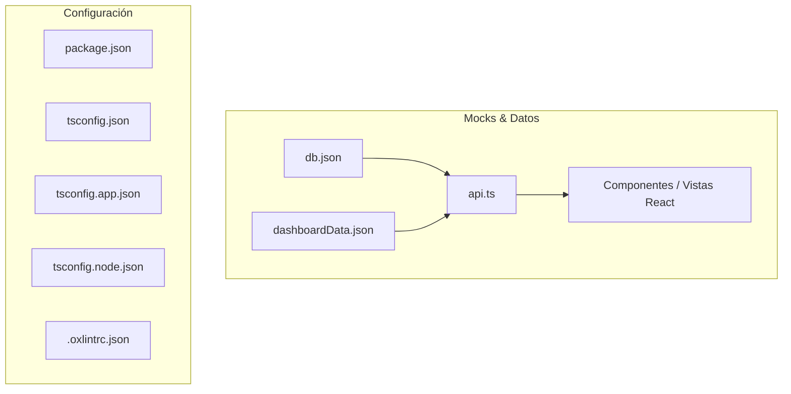

# Inventario y Organización de Archivos JSON del Proyecto SySAF

Este documento contiene la ubicación, clasificación y descripción de todos los archivos JSON utilizados en el proyecto SySAF, divididos en **Archivos de Datos/Mocks** y **Archivos de Configuración del Proyecto**.

---

## 1. Archivos JSON de Datos y Mocks

Estos archivos contienen los datos simulados que alimentan la interfaz de usuario a través del servicio [`api.ts`](file:///c:/Users/luisa/Desktop/SYPAGO/SySAF/src/mocks/api.ts).

### 📄 [`src/mocks/db.json`](file:///c:/Users/luisa/Desktop/SYPAGO/SySAF/src/mocks/db.json)
* **Categoría:** Mock Server / Base de Datos Mock
* **Ubicación:** `src/mocks/db.json`
* **Consumido por:** [`src/mocks/api.ts`](file:///c:/Users/luisa/Desktop/SYPAGO/SySAF/src/mocks/api.ts)
* **Propósito:** Contiene los conjuntos de datos principales para los distintos módulos de la aplicación (Reglas, Lista Negra, Cuarentena, Reportes, Excepciones y Dashboard).
* **Estructura Interna:**
  * `reports`: Lista de 100 transacciones y reportes del sistema.
  * `operationTypes`: Catálogo de tipos de operación (ej. Transferencia, Pago Móvil).
  * `operationStatuses`: Catálogo de estados (Aprobada, Rechazada, Pendiente, etc.).
  * `quarantine`: Transacciones retenidas en cuarentena.
  * `riskStats`: Métricas y porcentajes de nivel de riesgo (Crítico, Alto, Medio, Bajo).
  * `blacklist`: Registros de usuarios/cuentas en lista negra.
  * `rulesChannel`: Conjunto de reglas configuradas por canal.
  * `rulesViewer`: Lista de reglas para el visor de reglas.
  * `userExceptions`: Reglas de excepción por usuario.
  * `dashboardStats`: Configuración de gráficas, métricas y leyendas del Dashboard.

---

### 📄 [`src/mocks/dashboardData.json`](file:///c:/Users/luisa/Desktop/SYPAGO/SySAF/src/mocks/dashboardData.json)
* **Categoría:** Mock Server / Datos Dinámicos del Dashboard
* **Ubicación:** `src/mocks/dashboardData.json`
* **Consumido por:** [`src/mocks/api.ts`](file:///c:/Users/luisa/Desktop/SYPAGO/SySAF/src/mocks/api.ts)
* **Propósito:** Almacena los datos filtrados por período de tiempo y tipo de métrica para la visualización gráfica y estadística del Dashboard.
* **Estructura Interna:**
  * `filters`: Opciones de filtrado temporal (`24h`, `7d`, `30d`) y por métrica (`cantidades`, `montos`).
  * `stats`: Mapeo de datasets estadísticos agrupados por clave (`24h_cantidades`, `7d_cantidades`, `30d_cantidades`, `24h_montos`, `7d_montos`, `30d_montos`).

---

## 2. Adaptador / Consumidor TypeScript

### 🛠️ [`src/mocks/api.ts`](file:///c:/Users/luisa/Desktop/SYPAGO/SySAF/src/mocks/api.ts)
* **Ubicación:** `src/mocks/api.ts`
* **Propósito:** Módulo TypeScript encargado de importar `db.json` y `dashboardData.json`, exponiendo funciones asíncronas con retardo de red simulado (`delay`) para abastecer las vistas de React:
  * `getReports()`
  * `getFilters()`
  * `getQuarantine()`
  * `getRiskStats()`
  * `getBlacklist()`
  * `getRulesViewer()`
  * `getRulesChannel()`
  * `getUserExceptions()`
  * `getDashboardFilters()`
  * `getDashboardStats(period, metricType)`

---

## 3. Archivos JSON de Configuración del Proyecto

Estos archivos definen la configuración del entorno de desarrollo, empaquetado, herramientas de linting y compilador TypeScript.

| Archivo | Ubicación | Propósito |
| :--- | :--- | :--- |
| [`package.json`](file:///c:/Users/luisa/Desktop/SYPAGO/SySAF/package.json) | `/package.json` | Manifiesto de Node.js: dependencias (React 19, Lucide, Zustand), scripts de npm (`dev`, `build`, `lint`). |
| [`tsconfig.json`](file:///c:/Users/luisa/Desktop/SYPAGO/SySAF/tsconfig.json) | `/tsconfig.json` | Configuración principal/raíz de TypeScript que enlaza las configuraciones de App y Node. |
| [`tsconfig.app.json`](file:///c:/Users/luisa/Desktop/SYPAGO/SySAF/tsconfig.app.json) | `/tsconfig.app.json` | Configuración de TypeScript orientada a la aplicación web React (`src/`). |
| [`tsconfig.node.json`](file:///c:/Users/luisa/Desktop/SYPAGO/SySAF/tsconfig.node.json) | `/tsconfig.node.json` | Configuración de TypeScript utilizada para herramientas y scripts Node (ej. `vite.config.ts`). |
| [`.oxlintrc.json`](file:///c:/Users/luisa/Desktop/SYPAGO/SySAF/.oxlintrc.json) | `/.oxlintrc.json` | Reglas y preferencias de linteo estático configuradas para Oxlint. |

---

## 📊 Resumen Estadístico de Archivos JSON

* **Total de archivos `.json` de datos mock:** 2 ([`db.json`](file:///c:/Users/luisa/Desktop/SYPAGO/SySAF/src/mocks/db.json), [`dashboardData.json`](file:///c:/Users/luisa/Desktop/SYPAGO/SySAF/src/mocks/dashboardData.json))
* **Total de archivos `.json` de configuración:** 5 ([`package.json`](file:///c:/Users/luisa/Desktop/SYPAGO/SySAF/package.json), [`tsconfig.json`](file:///c:/Users/luisa/Desktop/SYPAGO/SySAF/tsconfig.json), [`tsconfig.app.json`](file:///c:/Users/luisa/Desktop/SYPAGO/SySAF/tsconfig.app.json), [`tsconfig.node.json`](file:///c:/Users/luisa/Desktop/SYPAGO/SySAF/tsconfig.node.json), [`.oxlintrc.json`](file:///c:/Users/luisa/Desktop/SYPAGO/SySAF/.oxlintrc.json))
